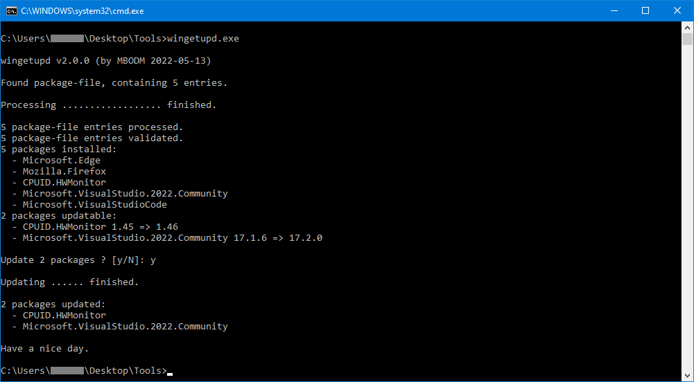

# wingetupd
A tiny command line tool, using [WinGet](https://docs.microsoft.com/en-us/windows/package-manager/winget) to update a user-defined set of packages on a Windows machine.

### What it is
It´s a simple and tiny tool named `wingetupd.exe`, used on the Windows command line. The tool works on top of the popular Windows-App [WinGet](https://docs.microsoft.com/en-us/windows/package-manager/winget). The tool uses _WinGet_, to update a specific user-defined set of packages, on a Windows machine.

When using _WinGet_ to install and update Windows software, `wingetupd.exe` just wants to make your life a tiny bit easier, by updating all your software (or better said: a specific bunch of software) within a single call.

`wingetupd.exe` is specifically __not__ designed to install packages, that actually aren´t already installed on your machine. It´s sole purpose is just to update your installed packages. Means: Before you can update some of your applications with this tool, you have to install them "by hand" or by using _WinGet_. In short: This tool can not (and want not) install any software. It´s just there for updating your already existing software.

Btw: _WinGet_ is imo a __fantastic__ piece of software, to manage all of your Windows applications and keep your Windows software up2date. Fat kudos :thumbsup: to Microsoft here!  For more information about _WinGet_ itself, take a look at https://docs.microsoft.com/en-us/windows/package-manager/winget or use your Google-Fu techniques.

### How it works
- When started, `wingetupd.exe` searches for a so-called "package-file". The package-file is simply a file named "_packages.txt_", located in the same folder as the `wingetupd.exe`. The package-file contains a list of _WinGet_ package-id´s (__not__ package-names, this is important, see [Notes](#Notes) section below).
- So, when `wingetupd.exe` is started and it founds a package-file, it just checks for each _WinGet_ package-id listed in the package-file, if that package exists, if that package is installed and if that package has an update. If so, it updates the package. `wingetupd.exe` does all of this, by using _WinGet_ internally.
- This means: All you have to do, is to edit the package-file and insert the _WinGet_ package-id´s of your installed Windows applications you want to update. When `wingetupd.exe` is executed, it will try to update all that packages (aka "your Windows applications").

### Requirements
There are not any special requirements, besides having _WinGet_ installed on your machine. `wingetupd.exe` is just a typical command line _.exe_ file for Windows. Just download the newest release, from the [_Releases_](https://github.com/MBODM/wingetupd/releases) page, unzip and run it. All the releases are compiled for x64, assuming you are using some 64-bit Windows (and that's quite likely).

### Notes
- When `wingetupd.exe` starts, it creates a log file named "_wingetupd.log_" in the same folder.
- So keep in mind: That folder needs security permissions for writing files in it.
- Some locations like "_C:\\_" or "_C:\ProgramFiles_" don´t have such security permissions (for a good reason).
- If you don´t wanna run `wingetupd.exe` just from your Desktop, "_C:\Users\USERNAME\AppData\Local_" is fine too.
- You can also use the `--no-log` parameter, to prevent the creation of the log file (`wingetupd.exe --no-log`).
- The log file contains all the internally used _WinGet_ calls and their output, so you can exactly see how _WinGet_ was used.
- Use `winget search`, to find out the package-id´s (you put into the package-file) of your installed applications.
- All internally used _WinGet_ calls are based on exact _WinGet_ package-id´s (_WinGet_ parameters: `--exact --id`).
- _Why not just use `winget --upgrade-all` ?_ Well, often you don´t wanna update everything (i.e. runtimes).
- _Why not just use some .bat or .ps script ?_ Well, `wingetupd.exe` is maybe a better "_out of the box_" approach.
- `wingetupd.exe` asks the user, if it should update the updatable packages.
- You can use the `--no-confirm` parameter to automatically update all updatable packages, without asking for a confirmation (`wingetupd.exe --no-confirm`).
- `wingetupd.exe` asks the user for pressing a key, before it exits (for an easier usage, when started by doubleclick in _Windows Explorer_).
- By using the `--no-confirm` parameter this confirmation is also omitted (useful for script integration).
- At time of writing, the package-id _Zoom.Zoom_ seems to missmatch the corresponding installed _Zoom_ package.
- I assume the _WinGet_-Team will correct this wrong behaviour in their [packages repository](https://github.com/microsoft/winget-pkgs/tree/master/manifests) soon.
- `wingetupd.exe` is written in C#, is using .NET 6 and is built with _Visual Studio 2022_.
- If you wanna compile the source by your own, you just need _Visual Studio 2022 Community_ (or one of the other editions). Nothing else.
- The release-binaries are compiled as _self-contained_ .NET 6 .exe files, with "_x64 Windows_" as target.
- _Self-contained_: That´s the reason why the binariy-size is 15 MB and why there is no framework requirement.
- The _.csproj_ source file contains some _MSBUILD_ task, to create a zip file, when publishing with _Visual Studio 2022_.
- GitHub´s default _.gitignore_ excludes _Visual Studio 2022_ publish-profiles, so i added a [publish-settings screenshot](img/screenshot-publish-settings.png) to repo.
- The source is using an asynchronous TAP pattern approach, including "_Progress&lt;T&gt;_" and "_async/await_" concepts.
- `wingetupd.exe` just exists, because i am lazy and made my life a bit easier, by writing this tool. :grin:

#### Have fun.
