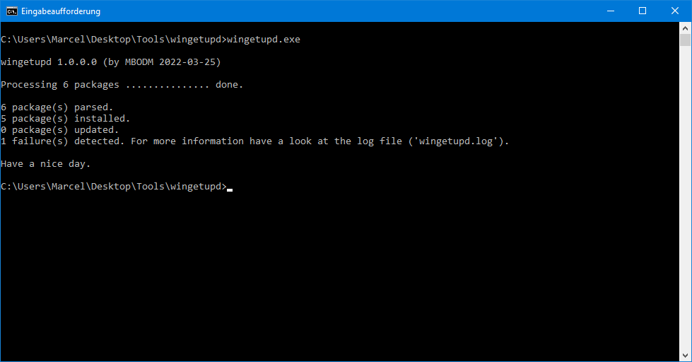
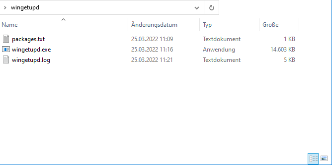

# wingetupd
A tiny commandline tool, using _WinGet_ to update specific Windows packages.

### What it is
It´s a simple tiny tool named _wingetupd.exe_. The tool works on top of the popular Windows-Tool _WinGet_, by using _WinGet_ to update a specific bunch of packages, on a Windows machine. When using _WinGet_ to install and update Windows software, _wingetupd.exe_ just wanna make your life a tiny bit easier, by updating all your software (or better said: a specific set of software) with a single click.

### How it works
When started _wingetupd.exe_ first looks for a so-called packages-file. The packages-file is simply a file named "_packages.txt_" in the same folder as _wingetupd.exe_. The package-file contains a list of _WinGet_ package ID´s (not package names, this is important). When started _wingetupd.exe_ just look for each package ID (in the package-file), if the package exists, if the package is installed and if the package has an update. If so, it updates the package.

